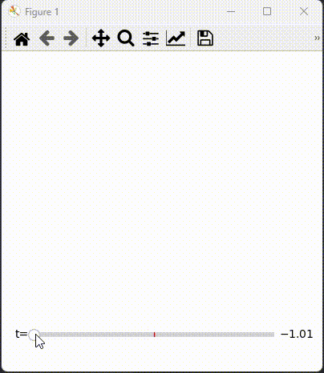

Graphs sublevel sets of scalar functions of the Torus (as $ℝ^2/{ℤ^2}$), i.e. for some $t\in ℝ$ it graphs $\\{f(u,v) <t \\}$ using [matplotlib](https://matplotlib.org/) in python.

An example is the function $f(u,v) = \sin(2\pi u)\cos(8\pi v)$

 
